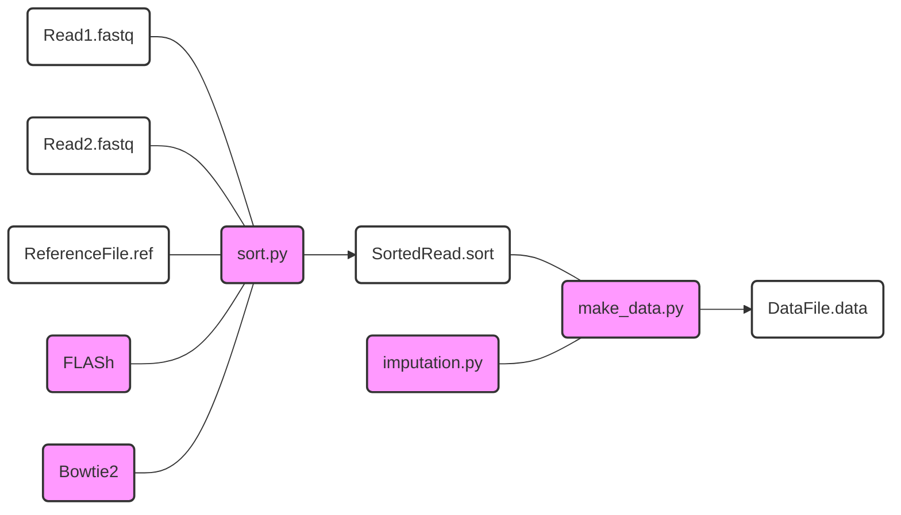

# Slide-seq

## Overview

Slide-seq is a high-throughput technique for mapping nucleosome positions on the DNA template with base-pair resolution. This method builds on and extends the previously developed histone-contact mapping technique using a photo-crosslinker [1]. Briefly, the histone (H2BS53C) is site-specifically labeled with a photo-crosslinker (azido phenacyl bromide), which crosslinks and cleaves the nucleosomal DNA exactly 53 base pairs from the nucleosome dyad. Using Next-Generation Sequencing (NGS), the cleavage sites across all DNA sequences are identified, allowing the inference of nucleosome positions on the DNA template. With this technique, we investigated the effects of DNA sequences and base-pairing defects on Chd1 chromatin remodeling [2-3].


## Analysis workflow
This is a summary of the workflow for Condense-seq analysis, from the FASTQ file processing to condensability score computation.



## Usage
The following is a list of custom Python scripts used for Slide-seq analysis, located in the *prepro_scripts* folder. Detailed usage instructions and execution examples are provided below click-and-drop menus.

<details>
<summary> sort.py </summary>

Sort the reads in the FASTQ files based on the reference sequences and identify the cleavage locations.

  ```
  python sort.py Read1.fastq Read2.fastq ReferenceFile.ref -o out_fname
  ```

</details>


<details>
<summary> make_data.py </summary>

Map the cleavage locations onto the top and bottom strands of the DNA template, and impute missing data to infer nucleosome dyad positions.

  ```
  python make_data.py SortedRead.sort -x ReferenceFile.ref --fill linear -o out_fname
  ```

</details>


## IPython notebook
Further analysis and graph generation are documented in IPython notebooks, which can be found in the *ipython_notebooks* folder

## Data deposition
All raw FASTQ files and processed data from the publication [2-3] have been deposited in NCBI GEO database with accession number GSE198440.

## Reference

[1] https://doi.org/10.1016/S0076-6879(03)75013-7\
[2] https://doi.org/10.1101/2022.04.19.488687\
[3] https://doi.org/10.1093/nar/gkad738\
